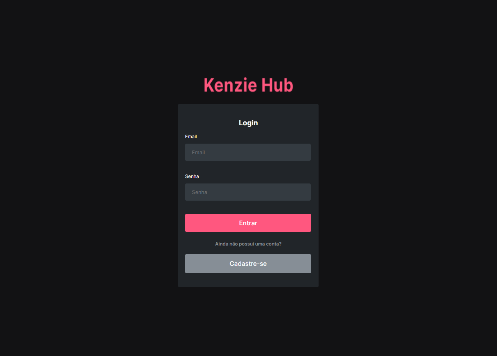
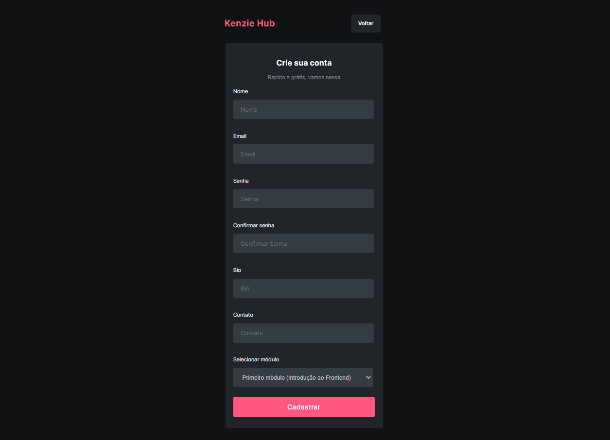
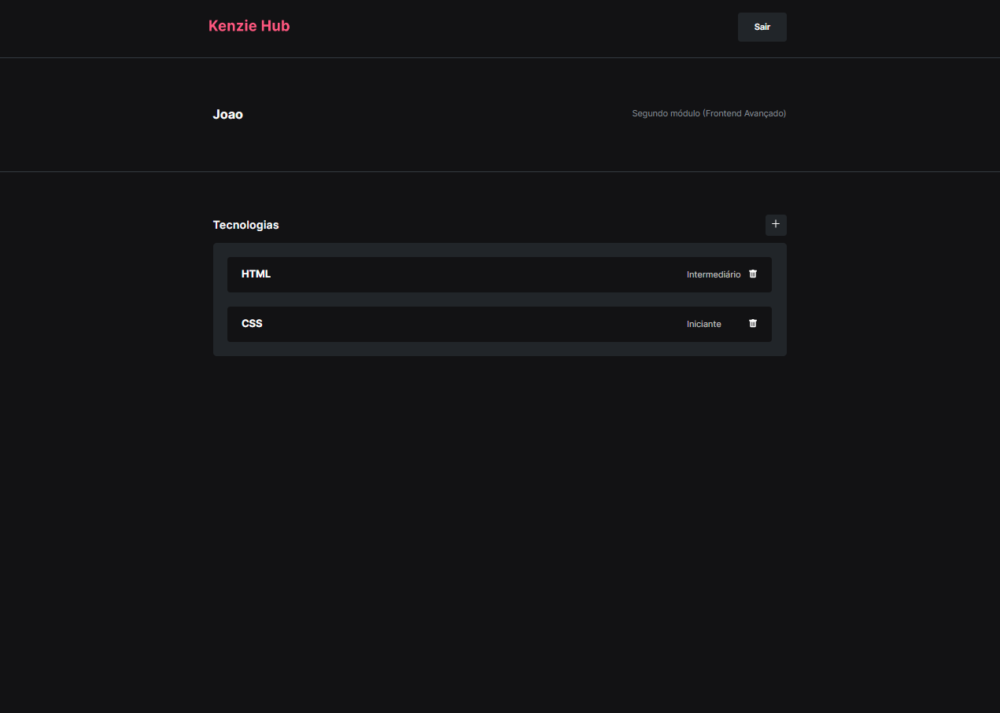
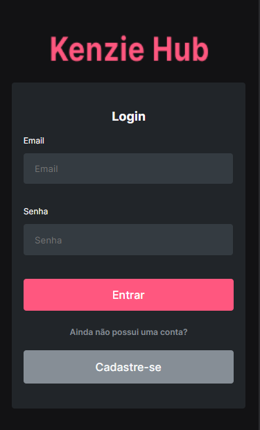
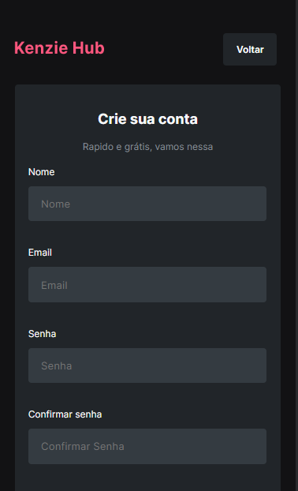
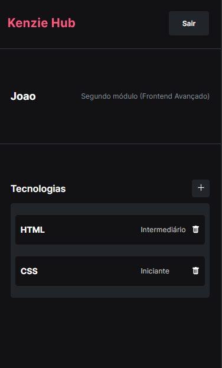

# Kenzie-Hub

Este é um projeto acadêmico com o foco em validações para o usuário realizar um cadastro ou entrar em seu perfil realizando login. É uma aplicação onde o usuário após fazer login pode cadastrar ou apagar tecnologias que aprendeu e determinar em qual nível de conhecimento da mesma ele está, podendo ser iniciante, intermediário ou avançado. Foi pensado nos alunos da Kenzie Academy Brasil, para que eles possam ir adicionando tecnologias adiquiridas no decorrer do curso.

## Visite o site!!

https://kenzie-hub-blush.vercel.app/

## Layout

### Desktop

Login:



Cadastro:



Dashboard:



### Mobile

Login:



Cadastro:



Dashboard:



## Rode o projeto na sua máquina:

#### Pré-requisitos:

Antes de começar, você vai precisar ter instalado em sua máquina as seguintes ferramentas:

- [Git](https://git-scm.com/downloads)
- [Node.js](https://nodejs.org/en/download/)
- [Yarn](https://classic.yarnpkg.com/en/docs/install#windows-stable)

#### Rodando o projeto:

```bash
# Clone este repositório
$ git clone https://github.com/Edmar-Cardoso/kenzie-hub.git

#Acesse a pasta do projeto no terminal/cmd
$ cd kenzie-hub

#Instale as dependêcias
$ yarn

#Execute a aplicação em modo de desenvolvimento
$ yarn start

#O servidor iniciará na porta 3000
```

##### Tecnologias usadas:

- React
- Typescript
- API REST

##### Bibliotecas e hooks usados:

- useState
- context
- react-hook-form
- yup
- axios
- styled-components
- react-toastfy
- react-dom
- react-icons
- react-router-dom
- framer-motion

##### Créditos:

- Banco de dados e API fonecidos pela Kenzie Academy Brasil
- Desenvolvido por [Edmar-Cardoso](https://github.com/Edmar-Cardoso)
